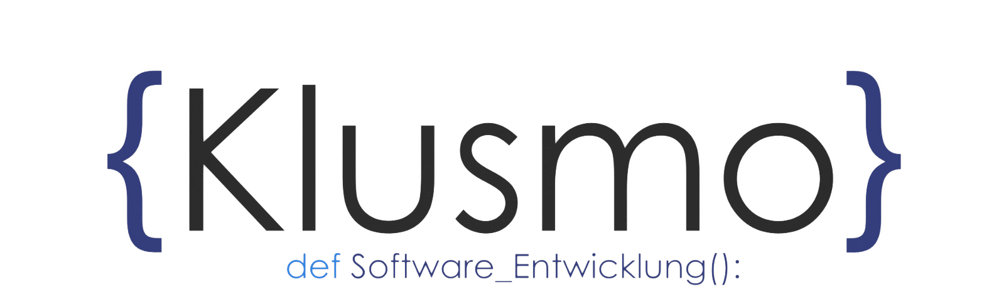

  

<h3 align="center">
Moin, ich bin Leon 👋
</h3>
<h2 align="center">
Ich spezialisiere mich gerade zum Backend Developer 💻 und arbeite mich in die Firmengründung ein
</h2> 

## 🔭 Ich arbeite gerade an:

- KlusmoMGR bei Klusmo UG | in Gründung
- meinem Abitur

## 🌱 Ich lerne gerade:

- tiefergehendes in Themen, wie Django & APIs
- SQL
- Firmengründung

## 👯 Ich arbeite zusammen mit:
- <a href="https://github.com/finnk8">Finn Klusmann </a>
